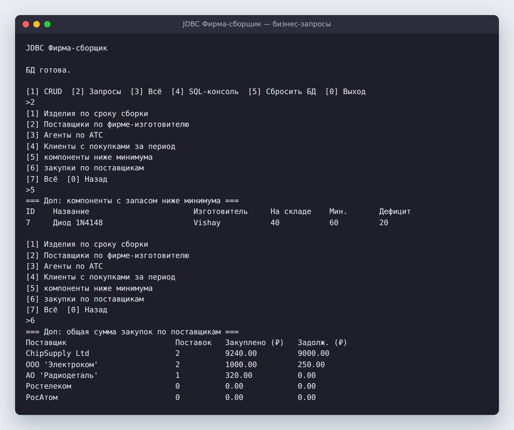
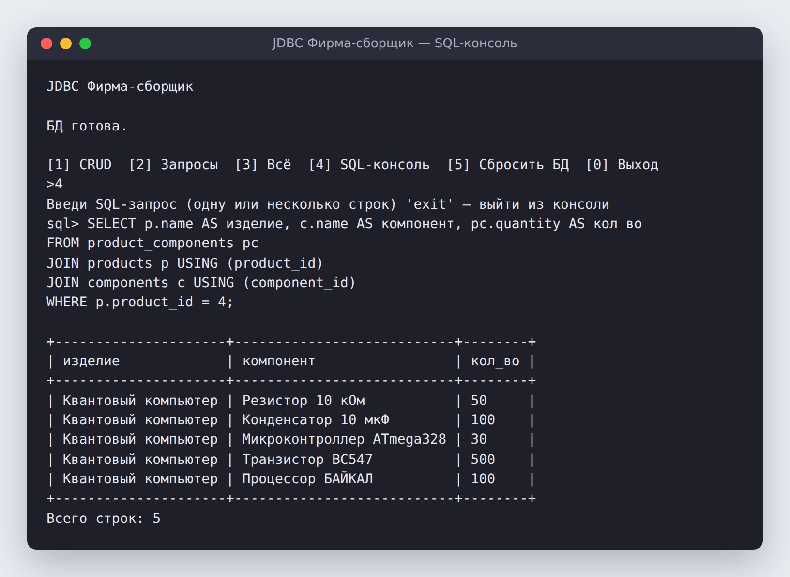
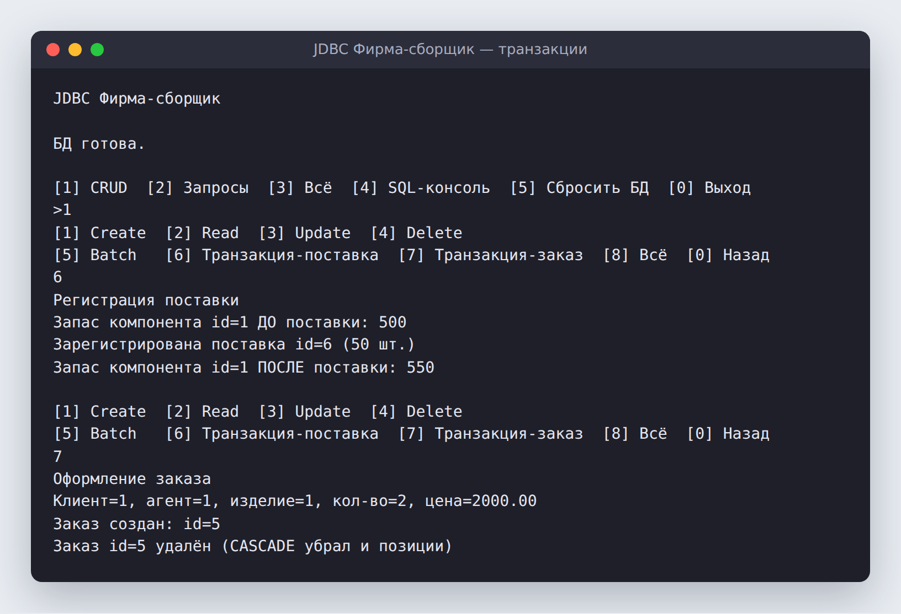
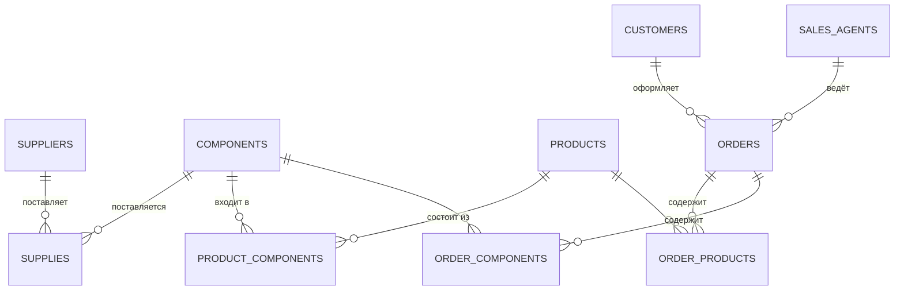

# 🏭 JDBC Фирма-сборщик

Консольное приложение на **Java 21 + JDBC + PostgreSQL** для учёта фирмы, которая собирает электронные изделия: поставщики, компоненты на складе, изделия и их состав, клиенты, торговые агенты и заказы.

В проекте показаны CRUD-операции, пакетная вставка, транзакции с откатом, аналитические SQL-запросы и встроенная SQL-консоль, которая выводит результат таблицей.


---

## 📸 Как это выглядит

**Бизнес-запросы:** дефицит компонентов на складе и сумма закупок по поставщикам



**SQL-консоль:** можно ввести любой запрос, в том числе многострочный, и получить результат в виде таблицы



**Транзакции:** регистрация поставки обновляет остаток на складе, а заказ создаётся вместе со всеми позициями



---

## ✨ Возможности

| Раздел | Что умеет |
|---|---|
| **CRUD** | Создание, чтение, обновление и удаление записей через DAO-слой |
| **Batch** | Пакетная вставка 10 компонентов одним запросом (`addBatch` / `executeBatch`) |
| **Транзакция «Поставка»** | Запись поставки и пополнение склада выполняются атомарно. При ошибке срабатывает `rollback` |
| **Транзакция «Заказ»** | Заказ создаётся вместе с позициями, при удалении позиции убираются каскадно (`ON DELETE CASCADE`) |
| **Бизнес-запросы** | Изделия по сроку сборки, поставщики нужного производителя, агенты по коду АТС, клиенты с покупками за период, компоненты ниже минимального остатка, сумма закупок и задолженность по поставщикам |
| **SQL-консоль** | Выполняет произвольный SQL и печатает результат таблицей с автоматической шириной колонок |
| **Сброс БД** | Пересоздаёт схему и заново заполняет её тестовыми данными |

## 🧱 Архитектура

```
src/main/java/com/firma
├── Main.java                  # консольное меню
├── db/
│   ├── ConnectionManager.java # пул соединений HikariCP (настройки в application.properties)
│   └── SchemaInitializer.java # создаёт схему из schema.sql и заполняет тестовыми данными
├── model/                     # сущности: Supplier, Component, Product, Customer, SalesAgent, Supply, Order
├── dao/                       # доступ к данным: PreparedStatement, getGeneratedKeys, batch, транзакции
└── service/
    ├── CrudDemoService.java       # демонстрация CRUD и транзакций
    ├── BusinessQueryService.java  # аналитические запросы
    └── SqlConsoleService.java     # SQL-консоль с табличным выводом
src/main/resources
├── schema.sql                 # 10 таблиц, внешние ключи, CHECK-ограничения, индексы
├── application.properties     # подключение к БД и настройки пула
└── logback.xml                # логирование
```

## 🗄️ Схема базы данных



Целостность данных обеспечивают `CHECK` (остаток ≥ 0, объём поставки > 0), `UNIQUE (name, manufacturer)` и продуманные правила удаления: `RESTRICT`, `CASCADE` и `SET NULL`. Под обязательные запросы созданы отдельные индексы.

## 🚀 Запуск

**Нужно:** JDK 21+, Maven, PostgreSQL.

1. Создай базу данных:
   ```sql
   CREATE DATABASE "Firma_6var";
   ```
2. При необходимости поменяй логин и пароль в `src/main/resources/application.properties`.
3. Собери и запусти проект:
   ```bash
   mvn compile exec:java
   ```
   Схема и тестовые данные создадутся автоматически при старте.

## 🛠️ Стек

Java 21 · JDBC · PostgreSQL · HikariCP · SLF4J + Logback · Maven
